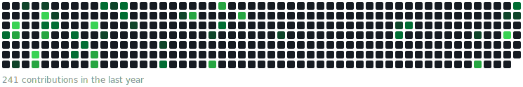

<!--LANG-STATS:START-->

```
HTML        ███████░░░░░░░░░░░░░   37.4%
JavaScript  █████░░░░░░░░░░░░░░░   24.6%
CSS         ███░░░░░░░░░░░░░░░░░   12.6%
C           █░░░░░░░░░░░░░░░░░░░    7.4%
Python      █░░░░░░░░░░░░░░░░░░░    7.4%
TypeScript  █░░░░░░░░░░░░░░░░░░░    6.9%
Shell       █░░░░░░░░░░░░░░░░░░░    3.7%
```

<!--LANG-STATS:END-->
