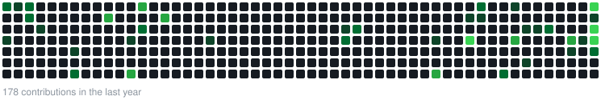

<h3> Normalized across intra inter</h3>
<!--LANG-STATS:START-->

```
HTML        ██████░░░░░░░░░░░░░░   31.2%
JavaScript  █████░░░░░░░░░░░░░░░   26.8%
CSS         ███░░░░░░░░░░░░░░░░░   12.5%
C           ██░░░░░░░░░░░░░░░░░░   10.0%
Python      ██░░░░░░░░░░░░░░░░░░   10.0%
TypeScript  █░░░░░░░░░░░░░░░░░░░    6.2%
Shell       █░░░░░░░░░░░░░░░░░░░    3.3%
```

<!--LANG-STATS:END-->
