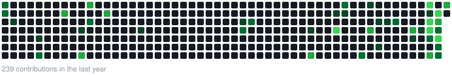

<h3> Normalized across intra inter</h3>
<!--LANG-STATS:START-->

```
HTML        ███████░░░░░░░░░░░░░   35.6%
JavaScript  █████░░░░░░░░░░░░░░░   27.4%
CSS         ██░░░░░░░░░░░░░░░░░░   12.4%
Python      ██░░░░░░░░░░░░░░░░░░    8.7%
C           ██░░░░░░░░░░░░░░░░░░    8.1%
TypeScript  █░░░░░░░░░░░░░░░░░░░    5.0%
Shell       █░░░░░░░░░░░░░░░░░░░    2.8%
```

<!--LANG-STATS:END-->
