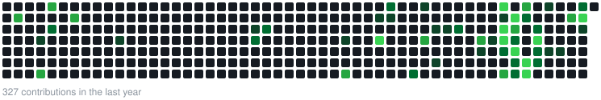

<h3> Normalized across intra inter</h3>
<!--LANG-STATS:START-->

```
HTML        ███████░░░░░░░░░░░░░   33.4%
JavaScript  █████░░░░░░░░░░░░░░░   26.7%
CSS         ██░░░░░░░░░░░░░░░░░░   12.2%
C           ██░░░░░░░░░░░░░░░░░░   10.0%
Python      ██░░░░░░░░░░░░░░░░░░    8.4%
TypeScript  █░░░░░░░░░░░░░░░░░░░    6.8%
Shell       █░░░░░░░░░░░░░░░░░░░    2.6%
```

<!--LANG-STATS:END-->
